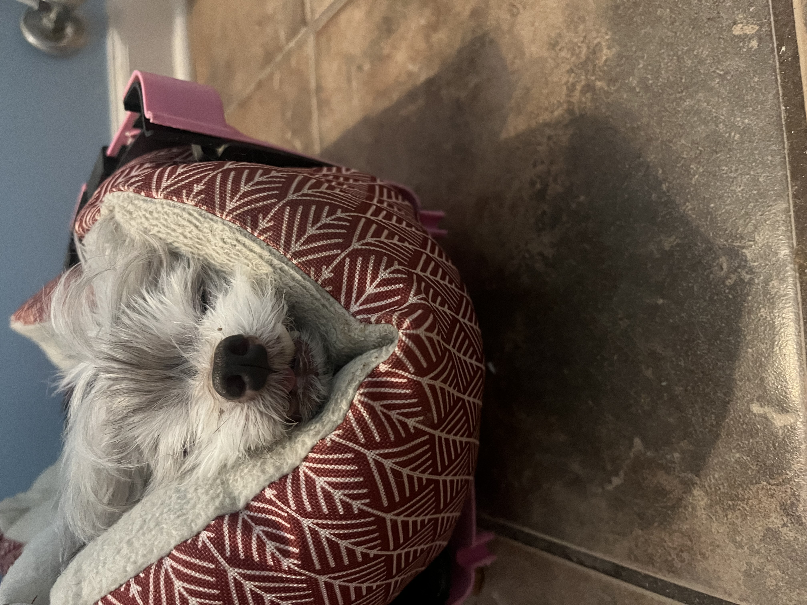
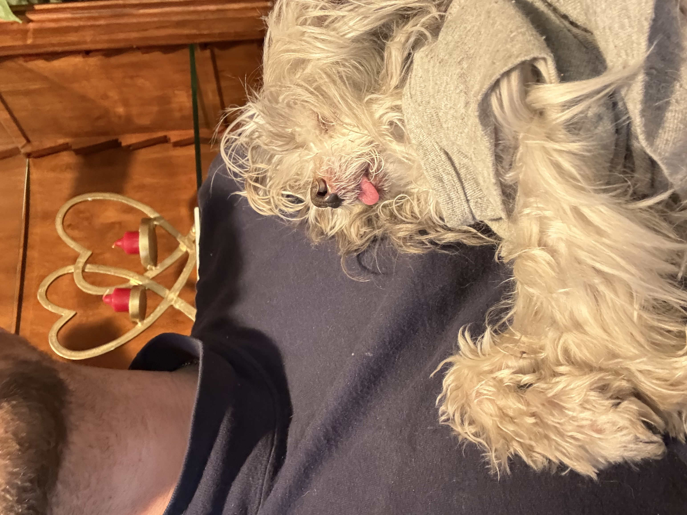
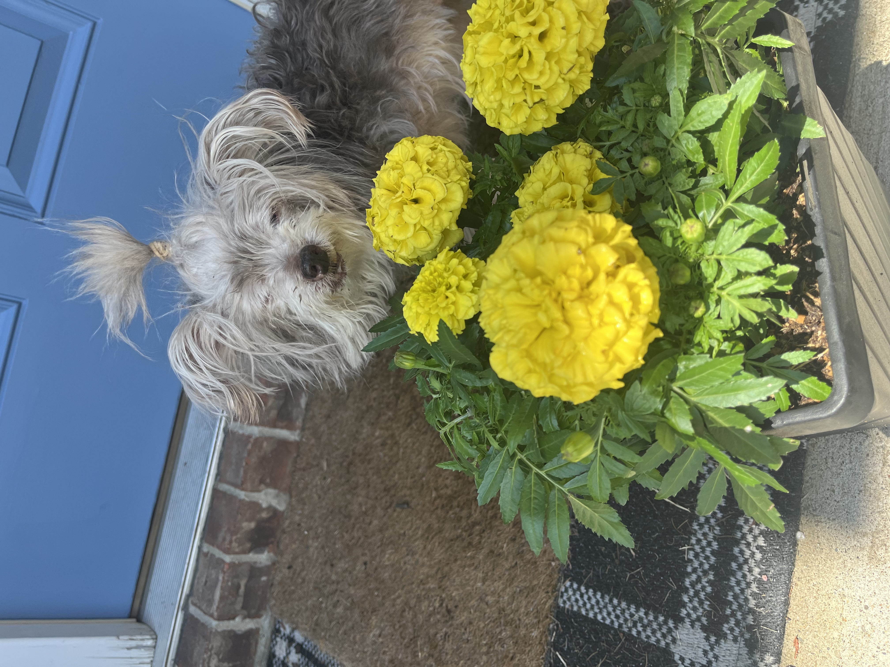
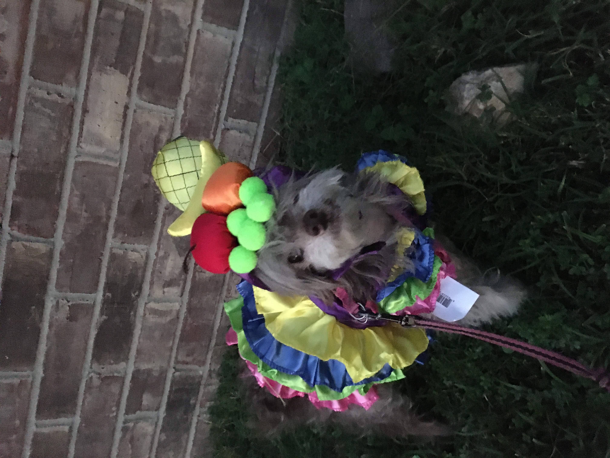

# StanleyMotlow.github.io
<!DOCTYPE html>
<html lang="en">
<head>
  <meta charset="UTF-8" />
  <meta name="viewport" content="width=device-width, initial-scale=1.0" />
  <title>Chloe's World</title>
  
</head>
<body>
 

    <header>
      <h1>Welcome to Chloe's World</h1>
      
A little corner dedicated to my beloved dog, Chloe.

    </header>
    <section class="content">
      
Hi, I'm Chloe—a Senior Dog.

      
I am 17 years old and blind, but still going strong!

      
         
      
      
    <footer>
      
&copy; 2025 Chloe's World. All rights reserved.

    </footer>
  

</body>
</html>
